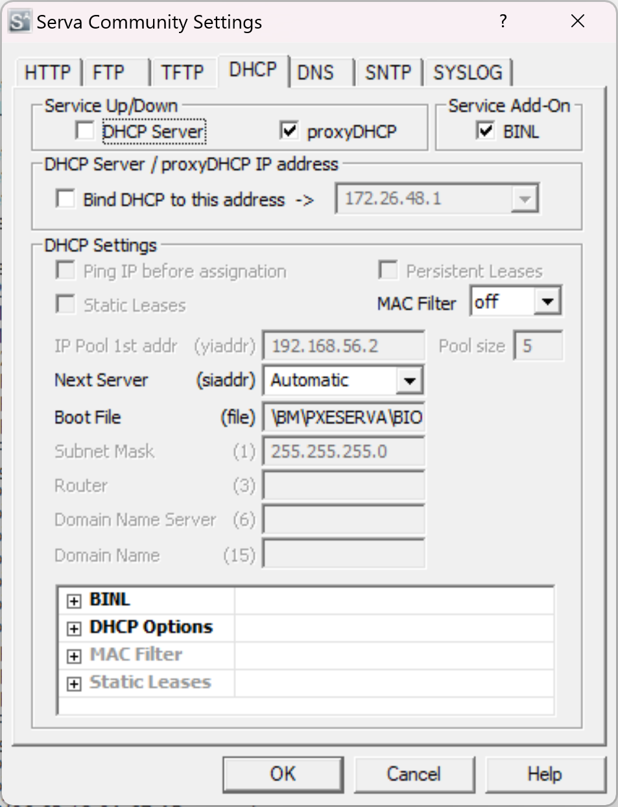
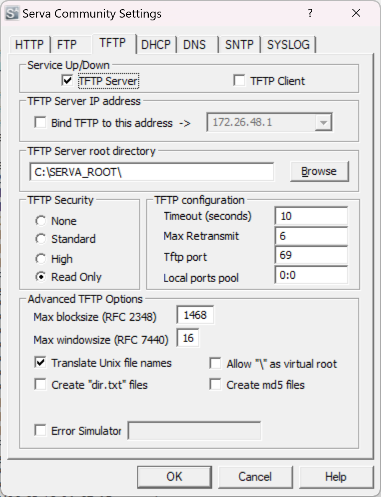
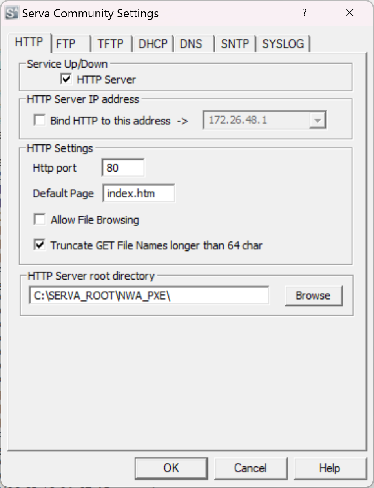
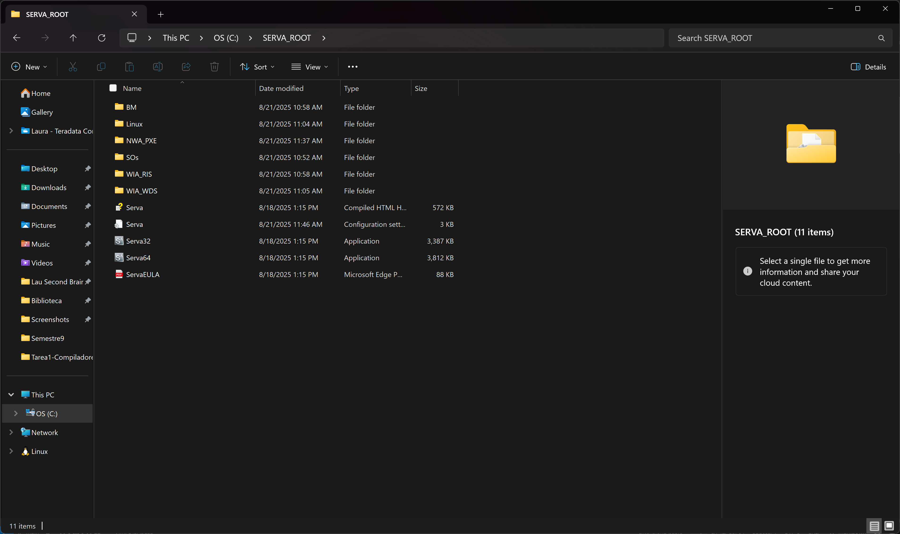

# Debian VM Installation via Serva PXE Boot - Implementation Report

## Project Overview
Successfully implemented a PXE (Preboot Execution Environment) boot server using Serva to install Debian Linux on a virtual machine over the network. This eliminates the need for physical installation media and enables automated network-based deployments.

## Prerequisites
- Set up [Serva](https://www.vercot.com/~serva/download.html) as a PXE boot server on Windows
- Download the [netboot](https://ftp.debian.org/debian/dists/stable/main/installer-amd64/current/images/netboot/)  environment for Debian installation.
- Configure you VM. It's important to change the boot order and to put the network with the bridge adapter

## Network Boot Menu Screenshot


## Implementation Steps

### Step 1: Environment Setup
**Location:** `C:\SERVA_ROOT\`
- Downloaded and extracted Serva PXE server software
- Verified directory structure with essential components:
  - `Serva64.exe` - Main application

- Open the app with admin privileges and enable TFTP and Proxy DHCP. This is the configuration that you should have for each connection

<div align="center">

<br>
<sub><b>Figure 1:</b> Serva DHCP Server Configuration Panel</sub>

<br><br>

<br>
<sub><b>Figure 2:</b> Serva TFTP Server Configuration Panel</sub>

<br><br>

<br>
<sub><b>Figure 3:</b> Serva HTTP Server Configuration Panel</sub>

</div>

- Restart the application, and reopened with admin privileges. 

- Now you should have these folders. 

<div align="center">

<br>
<sub><b>Figure 4:</b> SERVA_ROOT directory showing required files and folders for PXE boot</sub>

</div>
### Step 2: Debian Netboot Files Acquisition
**Source:** Official Debian repository
- Downloaded `netboot.tar.gz` from Debian mirrors
- Extracted netboot archive containing:
  - `linux` - Linux kernel (8,193,984 bytes)
  - `initrd.gz` - Initial RAM disk (40,697,786 bytes)
  - `pxelinux.0` - PXE bootloader
  - `pxelinux.cfg/` - Boot configuration directory
  - Supporting files for BIOS and UEFI boot

### Step 3: Directory Structure Configuration
**Target Structure:**
```
C:\SERVA_ROOT\
├── NWA_PXE\
│   └── Debian_12\
│       ├── debian-installer\
│       │   └── amd64\
│       │       ├── linux
│       │       ├── initrd.gz
│       │       ├── grub\
│       │       └── boot-screens\
│       ├── pxelinux.0
│       ├── pxelinux.cfg\
│       │   └── default
│       └── ServaAsset.inf
```

**Commands Executed:**
```powershell
mkdir NWA_PXE\Debian_12
Copy-Item "WIA_WDS\Linux\Debian\*" -Destination "NWA_PXE\Debian_12\" -Recurse -Force
```

### Step 4: ServaAsset.inf Configuration
Created asset information file following Serva v3.0 specifications:

```ini
[PXESERVA_MENU_ENTRY]
asset = Debian 12 Netboot
platform = amd64
kernel_bios = /NWA_PXE/$HEAD_DIR$/debian-installer/amd64/linux
append_bios = initrd=/NWA_PXE/$HEAD_DIR$/debian-installer/amd64/initrd.gz priority=low vga=788
kernel_efi64 = /NWA_PXE/$HEAD_DIR$/debian-installer/amd64/linux
append_efi64 = initrd=/NWA_PXE/$HEAD_DIR$/debian-installer/amd64/initrd.gz priority=low vga=788
```

**Key Configuration Elements:**
- Asset name: "Debian 12 Netboot"
- Platform: AMD64 architecture
- Dual boot support: BIOS and UEFI
- Dynamic path resolution using Serva tokens

### Step 5: Serva Service Configuration

#### TFTP Server Setup
- **Service:** Enabled TFTP Server
- **Root Directory:** `C:\SERVA_ROOT`
- **Port:** 69 (standard TFTP port)
- **Security:** Read-only access
- **Purpose:** Serves boot files to PXE clients

#### DHCP Server Setup
- **Service:** Enabled DHCP Server
- **IP Pool:** 172.26.48.100 - 172.26.48.200
- **Boot Filename:** `pxelinux.0`
- **Next Server:** 172.26.48.1 (Serva host IP)
- **Purpose:** Assigns IP addresses and provides boot information

### Step 6: Virtual Machine Configuration
**VM Settings:**
- **Network Adapter:** Bridged mode (same network as Serva)
- **Boot Order:** Network/PXE boot as first priority
- **Legacy Support:** Enabled for PXE compatibility
- **Storage:** Empty (no installation media required)

### Step 7: PXE Boot Testing and Validation
**Boot Sequence:**
1. VM powered on with network boot enabled
2. DHCP request sent to Serva server
3. IP address assigned (172.26.48.x range)
4. TFTP download of `pxelinux.0` bootloader
5. PXE menu displayed with "Debian 12 Netboot" option
6. Kernel and initrd.gz downloaded via TFTP
7. Debian installer launched successfully

## Results and Verification

### Successful Outcomes
✅ **PXE Boot Environment:** Fully functional network boot infrastructure
✅ **File Delivery:** Successful TFTP transfer of boot components
✅ **Menu Integration:** Debian automatically detected and added to boot menu
✅ **Installer Launch:** Debian network installer loaded and running
✅ **Internet Connectivity:** Installer successfully connecting to Debian repositories

### Installation Progress
- **Phase 1:** "Checking the Debian archive mirror" - ✅ Completed
- **Phase 2:** "Downloading Release files" - ✅ In Progress
- **Next Steps:** Standard Debian installation workflow

## Technical Architecture

### Network Flow
```
VM Client → DHCP Request → Serva DHCP Server
         ← IP Assignment ←
         → TFTP Request → Serva TFTP Server
         ← Boot Files   ←
         → HTTP/FTP     → Internet (Debian Repos)
         ← Packages     ←
```

### File Dependencies
- **pxelinux.0:** Initial PXE bootloader
- **linux:** Debian kernel for installation
- **initrd.gz:** Initial filesystem with drivers and utilities
- **ServaAsset.inf:** Serva configuration for automatic discovery

## Troubleshooting Resolved

### Issue 1: File Permission Conflicts
**Problem:** vim couldn't write to default PXE configuration file
**Solution:** Removed problematic file and recreated with PowerShell
```powershell
Remove-Item .\default -Force
@"content"@ | Out-File -FilePath .\default -Encoding ASCII
```

### Issue 2: Incorrect Directory Structure
**Problem:** Initial placement in WIA_WDS instead of NWA_PXE
**Solution:** Reorganized files according to Serva documentation specifications

### Issue 3: Path Resolution in ServaAsset.inf
**Problem:** Incorrect kernel and initrd paths
**Solution:** Used proper Serva token syntax with $HEAD_DIR$ variable

## Best Practices Identified

1. **File Organization:** Follow Serva's NWA_PXE structure strictly
2. **Asset Configuration:** Use official ServaAsset.inf templates
3. **Network Isolation:** Consider DHCP conflicts with existing infrastructure
4. **Documentation:** Maintain detailed configuration records
5. **Testing:** Verify each component before full deployment

## Conclusion
Successfully implemented a complete PXE boot infrastructure using Serva, enabling network-based Debian installation on virtual machines. The solution demonstrates enterprise-level deployment capabilities suitable for:

- **Laboratory Environments:** Rapid VM provisioning
- **Educational Settings:** Standardized OS deployment
- **Development Operations:** Automated infrastructure setup
- **Disaster Recovery:** Network-based system restoration

## Future Enhancements
- **Multi-Distribution Support:** Add Ubuntu, CentOS, and other Linux distributions
- **Automated Configuration:** Implement preseed files for unattended installation
- **Security Hardening:** Configure TFTP access controls and authentication
- **Monitoring Integration:** Add logging and deployment tracking
- **High Availability:** Implement redundant PXE servers

## References
- [Serva PXE Documentation](https://www.vercot.com/~serva/an/NonWindowsPXE3.html)
- [Debian Netboot Installation Guide](https://www.debian.org/distrib/netinst)
- [PXE Boot Protocol Specification](https://tools.ietf.org/html/rfc4578)

---
**Project Status:** ✅ Successfully Completed  
**Implementation Date:** August 21, 2025  
**Total Setup Time:** ~2 hours  
**Verification:** Debian installer running and downloading packages